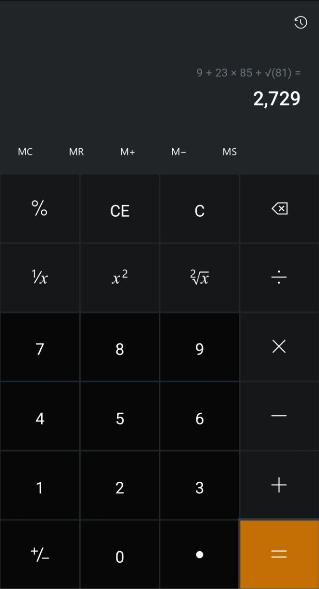
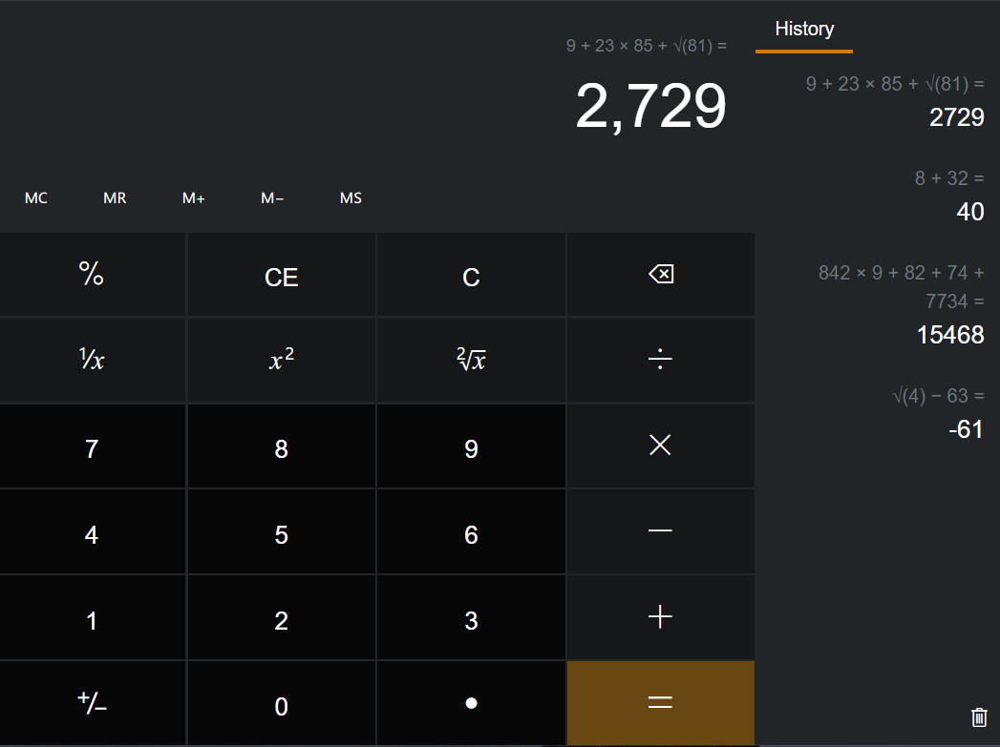

## Windows 10 Based Calculator App
A fully featured calculator made using [React](https://reactjs.org/) with :coffee: and :heart: by [softerboy](https://github.com/softerboy)

<table>
  <tr>
    <td width="26%">
      
    </td>
    <td width="60%">
      
    </td>
  </tr>
</table>

## Features:
* Responsive UI
* Keyboard input on Laptops (see section Keyboard for available key bindings)
* History
* Loading user's history from server (see section API layer to integrate with API layer)
* Saving user's calculations history to server
## Features need to implenent
Handling `MC`, `MR`, `M+`, `M-` and `MS` memory button functions

## How to run?

#### Prerequisites
In order to install and run this project locally,  
you would need to have the following installed on you local machine.
* [NodeJS](https://nodejs.org/en) v10+ or later as execution environment
* [Yarn](https://yarnpkg.com/) package manager for NodeJS  

:warning: It is strongly recommended to use **yarn** instead **npm**.

1. Clone this repository:
### `git clone https://github.com/softerboy/calculator.git`

2. Install project dependencies:
### `yarn install`

3. :point_down: And then see below for available scripts

## Available Scripts

In the project directory, you can run:

### `yarn start`

Runs the app in the development mode.<br />
Open [http://localhost:3000](http://localhost:3000) to view it in the browser.

The page will reload if you make edits.<br />
You will also see any lint errors in the console.

### `yarn test`

Launches the test runner in the interactive watch mode.<br />
See the section about [running tests](https://facebook.github.io/create-react-app/docs/running-tests) for more information.

### `yarn build`

Builds the app for production to the `build` folder.<br />
It correctly bundles React in production mode and optimizes the build for the best performance.

The build is minified and the filenames include the hashes.<br />
Your app is ready to be deployed!

See the section about [deployment](https://facebook.github.io/create-react-app/docs/deployment) for more information.

### `yarn eject`

**Note: this is a one-way operation. Once you `eject`, you can’t go back!**

If you aren’t satisfied with the build tool and configuration choices, you can `eject` at any time. This command will remove the single build dependency from your project.

Instead, it will copy all the configuration files and the transitive dependencies (webpack, Babel, ESLint, etc) right into your project so you have full control over them. All of the commands except `eject` will still work, but they will point to the copied scripts so you can tweak them. At this point you’re on your own.

You don’t have to ever use `eject`. The curated feature set is suitable for small and middle deployments, and you shouldn’t feel obligated to use this feature. However we understand that this tool wouldn’t be useful if you couldn’t customize it when you are ready for it.

### API Layer
:warning: To simplifying development process and easy to test, application utilizes package [axios-mock-adapter](https://github.com/ctimmerm/axios-mock-adapter). Which means, application will requests to already prepared mock server. Whenever your server ready to use with endpoints below, you need to comment out :point_right: **[this](https://github.com/softerboy/calculator/blob/master/src/index.js#L13)** line.

In order to save and load user history, your server must implement two endpoints.  
Below you see can see endpoint urls and their data shape in json format 

---

loads user history from server
```
GET /calculations

Content-Type application/json

[
  {
    "result": "40",
    "date": "12:23:35 01-01-2015Z",
    "calculation": "8 + 32 ="
  },
  {
    "result": "-61",
    "date": "12:45:35 01-01-2015Z",
    "calculation": "sqrt(4) - 63 ="
  }
]
```

---

posts recently calculations to server
```
POST /calculations

Content-Type: application/json

{
  "calculation": "1 + 3 * 34 =",
  "date": "2020-04-26T19:58:07.146Z",
  "result": "‭136‬"
}
```

## Keyboard bindings
* Numbers: `[0-9]`
* Percent: `%` or `P`
* Cancel Entry (CE): `C ` and then `E` key combinations
* Clear (C): `C` and then `C` key combinations (i.e. double `C`)
* Backspace: one of `Backspace` or  `Del` keys
* One over X: `O` key
* Square X: `S` and then `S`  (i.e. doubel `S`)
* Square Root: `S` and then `R` (stands for square root)
* Divide: `/` or `D` key
* Multiply: `*` or `M` key
* Subtract: `-` key
* Plus: `+` or `A` key
* Equal: one of `Enter`, `Space` or `=` keys
* Point: `.` key
* Sign: `S` and then `G` key combinations

---
Any issues or pull requests are welcome!

Happy hacking :blush:
